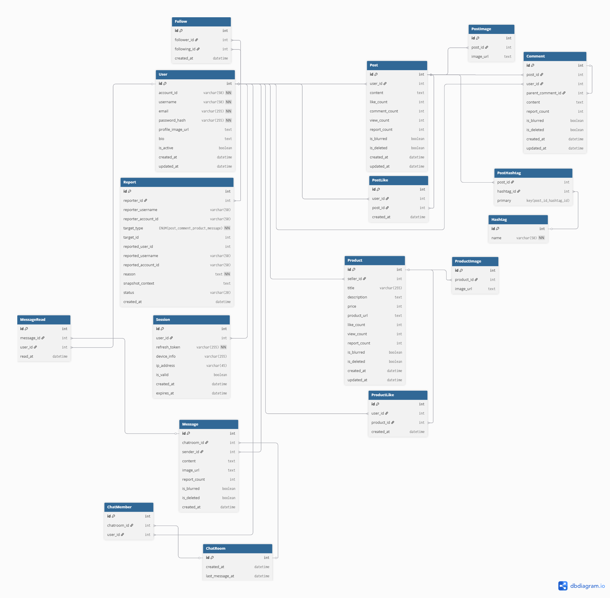

# ERD 상세

## 1. User - 사용자 계정 정보
| 필드                      | 의미              | 사용 목적                     |
| ----------------------- | --------------- | ------------------------- |
| id                      | PK, 사용자 고유 ID   | 다른 테이블의 FK 참조, 사용자 식별     |
| account_id              | 로그인용 고유 계정 ID   | 로그인 및 신고 기록, 화면 표시        |
| username                | 닉네임 (중복 허용)     | 프로필, 게시글/댓글 작성자 표시        |
| email                   | 이메일, 고유         | 계정 복구, 알림 발송              |
| password_hash           | 비밀번호 해시         | 로그인 인증, 보안상 원문 비밀번호 미저장   |
| profile_image_url       | 프로필 이미지 URL     | 프로필 화면 표시                 |
| bio                     | 자기소개            | 프로필 화면 표시                 |
| is_active               | 탈퇴 여부 관리        | 탈퇴 처리 시 게시글/댓글/상품과의 연동 유지 |
| created_at / updated_at | 계정 생성/마지막 수정 시각 | 가입일 표시, 회원정보 변경 내역 관리     |

- **사용 시나리오**:
    - 회원가입, 로그인/로그아웃, 프로필 조회, 게시글/댓글/상품 작성 시 작성자 정보 확인

## 2. Session - JWT 기반 세션 관리
| 필드            | 의미           | 사용 목적              |
| ------------- | ------------ | ------------------ |
| id            | PK, 세션 고유 ID | 세션 식별 및 관리         |
| user_id       | FK → User.id | 세션 소유자 연결          |
| refresh_token | JWT 리프레시 토큰  | 세션 갱신 및 인증 유지      |
| device_info   | 접속 기기 정보     | 로그인 이력 관리, 보안 모니터링 |
| ip_address    | 접속 IP 주소     | 로그인 위치 추적, 보안 모니터링 |
| is_valid      | 세션 유효 여부     | 로그아웃 시 세션 무효화      |
| created_at    | 세션 생성 시각     | 세션 생성 시간 기록        |
| expires_at    | 세션 만료 시각     | 토큰 유효 기간 관리        |

- **사용 시나리오**:
    - 로그인 시 세션 생성, 로그아웃 시 무효화, 각 요청 시 JWT 검증

## 3. Follow - 팔로우 관계
| 필드           | 의미                       | 사용 목적                    |
| ------------ | ------------------------ | ------------------------ |
| id           | PK, 팔로우 관계 고유 ID         | 팔로우 관계 식별                |
| follower_id  | FK → User.id, 팔로우 하는 사용자 | 팔로우 목록 조회, 팔로잉/팔로워 기능 구현 |
| following_id | FK → User.id, 팔로우 받는 사용자 | 팔로우 목록 조회, 팔로잉/팔로워 기능 구현 |
| created_at   | 팔로우 생성 시각                | 활동 기록, 정렬 기준             |

- **사용 시나리오**:
    - 사용자 팔로우/언팔로우, 팔로잉/팔로워 목록 조회

## 4. Post - 게시글
| 필드                      | 의미            | 사용 목적                 |
| ----------------------- | ------------- | --------------------- |
| id                      | PK, 게시글 고유 ID | 다른 테이블의 FK 참조, 게시글 식별 |
| user_id                 | FK → User.id  | 게시글 작성자 식별            |
| content                 | 게시글 텍스트 내용    | 게시글 화면 표시             |
| like_count              | 게시글 좋아요 수     | 게시글 좋아요 수 표시          |
| comment_count      | 게시글에 달린 댓글 수 | 게시글에 달린 댓글 수 표시 |
| view_count             | 게시글 조회 수         | 게시글 조회수 표시            |
| report_count            | 신고 누적 카운트     | 블러 처리 판단 기준           |
| is_blurred              | 블러 처리 여부      | 신고 3회 이상 시 게시글 숨김     |
| is_deleted              | 삭제 여부         | 삭제 처리 시 화면 표시 제외      |
| created_at / updated_at | 생성/수정 시각      | 게시글 작성/수정 시간 관리       |
- **사용 시나리오**:
    - 게시글 작성, 수정, 삭제, 피드 표시, 신고 처리

## 5. PostImage - 게시글 이미지
| 필드        | 의미            | 사용 목적            |
| --------- | ------------- | ---------------- |
| id        | PK, 이미지 고유 ID | 이미지 식별           |
| post_id   | FK → Post.id  | 어떤 게시글의 이미지인지 연결 |
| image_url | 이미지 URL       | 화면에 이미지 표시       |
- **사용 시나리오**:
    - 게시글 이미지 업로드, 표시

## 6. PostLike - 게시글 좋아요
| 필드         | 의미              | 사용 목적               |
| ---------- | --------------- | ------------------- |
| id         | PK, 게시글 좋아요 고유 ID   | 게시글 좋아요 기록 식별          |
| user_id    | FK → User.id     | 게시글 좋아요 누른 사용자 확인     |
| post_id    | FK → Post.id     | 게시글 좋아요 대상 게시글 확인     |
| created_at | 게시글 좋아요 생성 시각       | 기록 및 정렬 기준          |

- **사용 시나리오**:
    - 게시글 좋아요/취소, 사용자별 게시글 좋아요 조회

## 7. Comment - 댓글
| 필드                      | 의미           | 사용 목적               |
| ----------------------- | ------------ | ------------------- |
| id                      | PK, 댓글 고유 ID | 댓글 식별, 다른 테이블 FK 참조 |
| post_id                 | FK → Post.id | 어떤 게시글의 댓글인지 연결     |
| user_id                 | FK → User.id | 댓글 작성자 확인           |
| parent_comment_id       | 상위 댓글 ID (FK → Comment.id, 자기 참조) | 대댓글인 경우, 어느 댓글의 답글인지 구분. 최상위 댓글이면 NULL |
| content                 | 댓글 텍스트 내용    | 화면 표시               |
| report_count            | 신고 누적 카운트    | 블러 처리 판단 기준         |
| is_blurred              | 블러 처리 여부     | 신고 3회 이상 시 댓글 숨김    |
| is_deleted              | 삭제 여부        | 삭제 처리 시 화면 표시 제외    |
| created_at / updated_at | 생성/수정 시각     | 작성/수정 시간 관리         |

- **사용 시나리오**:
    - 댓글 작성, 수정, 삭제, 신고 처리

## 8. Product - 마켓플레이스 상품
| 필드                      | 의미           | 사용 목적               |
| ----------------------- | ------------ | ------------------- |
| id                      | PK, 상품 고유 ID | 상품 식별, 다른 테이블 FK 참조 |
| seller_id               | FK → User.id | 판매자 확인        |
| title                   | 상품 이름        | 상품 이름을 화면에 표시      |
| description             | 상품 설명        | 상품 설명을 화면에 표시     |
| price                   | 가격           | 상품 가격 화면에 표시     |
| product_url          | 상품 관련 URL | 상품 상세 정보 확인을 위한 외부 URL (선택적. NULL 가능)   |
| like_count            | 상품 좋아요 수          | 상품 좋아요 수 표시 |
| report_count            | 신고 누적 카운트    | 블러 처리 판단 기준         |
| is_blurred              | 블러 처리 여부     | 신고 3회 이상 시 상품 숨김    |
| is_deleted              | 삭제 여부        | 삭제 처리 시 화면 표시 제외    |
| created_at / updated_at | 생성/수정 시각     | 상품 등록/수정 시간 관리      |

- **사용 시나리오**:
    - 상품 등록, 수정, 삭제, 신고 처리

## 9. ProductImage - 상품 이미지
| 필드         | 의미              | 사용 목적           |
| ---------- | --------------- | --------------- |
| id         | PK, 이미지 고유 ID   | 이미지 식별          |
| product_id | FK → Product.id | 어떤 상품의 이미지인지 연결 |
| image_url  | 이미지 URL         | 화면에 이미지 표시      |

- **사용 시나리오**:
    - 상품 이미지 업로드, 표시

## 10. ProductLike - 상품 좋아요
| 필드         | 의미              | 사용 목적               |
| ---------- | --------------- | ------------------- |
| id         | PK, 상품 좋아요 고유 ID   | 상품 좋아요 기록 식별          |
| user_id    | FK → User.id     | 상품 좋아요 누른 사용자 확인     |
| product_id | FK → Product.id  | 상품 좋아요 대상 상품 확인       |
| created_at | 상품 좋아요 생성 시각       | 기록 및 정렬 기준          |

- **사용 시나리오**:
    - 상품 좋아요/취소, 사용자별 상품 좋아요 조회

## 11. ChatRoom - 채팅방
| 필드         | 의미            | 사용 목적  |
| ---------- | ------------- | ------ |
| id         | PK, 채팅방 고유 ID | 채팅방 식별 |
| created_at | 채팅방 생성 시각     | 기록 관리  |
| last_message_at | 최근 메시지 시각 | 채팅방 목록 정렬, 최근 대화 표시용 |

- **사용 시나리오**:
    - 1:1 채팅방 생성 및 조회, 최근 대화순 정렬

## 12. ChatMember - 채팅방 참여자
| 필드          | 의미               | 사용 목적           |
| ----------- | ---------------- | --------------- |
| id          | PK, 참여 기록 고유 ID  | 참여 기록 식별        |
| chatroom_id | FK → ChatRoom.id | 어떤 채팅방 참여자인지 연결 |
| user_id     | FK → User.id     | 참여자 확인          |

- **사용 시나리오**:
    - 채팅방 참여자 목록 조회, 참여/퇴장 처리

## 13. Message - 채팅 메시지
| 필드           | 의미               | 사용 목적             |
| ------------ | ---------------- | ----------------- |
| id           | PK, 메시지 고유 ID    | 메시지 식별            |
| chatroom_id  | FK → ChatRoom.id | 어느 채팅방의 메시지인지 연결  |
| sender_id    | FK → User.id     | 메시지 발신자 확인        |
| content      | 메시지 텍스트 내용       | 화면 표시             |
| image_url    | 이미지 URL          | 메시지 이미지 표시        |
| report_count | 신고 누적 카운트        | 블러 처리 판단 기준       |
| is_blurred   | 블러 처리 여부         | 신고 3회 이상 시 메시지 숨김 |
| is_deleted   | 삭제 여부            | 삭제 처리 시 화면 표시 제외  |
| created_at   | 생성 시각            | 메시지 작성 시간 기록      |

- **사용 시나리오**:
    - 메시지 전송, 수정, 삭제, 신고 처리

## 14. MessageRead - 메시지 읽음 상태
| 필드          | 의미                  | 사용 목적                  |
| ----------- | ------------------- | ---------------------- |
| id          | PK, 읽음 기록 고유 ID    | 읽음 상태 식별              |
| message_id  | FK → Message.id     | 어떤 메시지를 읽었는지 식별      |
| user_id     | FK → User.id        | 읽은 사용자 식별              |
| read_at     | 읽은 시각               | 읽음 표시, 알림 기능용         |

- **사용 시나리오**:
    - 메시지 읽음/안읽음 상태 표시
    - 사용자별 읽지 않은 메시지 카운트 기능

## 15. Hashtag - 해시태그
| 필드   | 의미             | 사용 목적                    |
| ---- | -------------- | ------------------------ |
| id   | PK, 해시태그 고유 ID | 해시태그 식별                  |
| name | 해시태그 텍스트, 고유   | 게시글/추천 기능 등에서 해시태그 검색/표시 |

- **사용 시나리오**:
    - 게시글 해시태그 관리, 친구 추천 기능 기반

## 16. PostHastag - 게시글&해시태그 관계
| 필드         | 의미              | 사용 목적                   |
| ---------- | --------------- | ----------------------- |
| post_id    | FK → Post.id    | 어떤 게시글에 연결된 해시태그인지 확인   |
| hashtag_id | FK → Hashtag.id | 어떤 해시태그가 게시글에 포함되었는지 확인 |

- **사용 시나리오**
    - 게시글별 해시태그 조회, 중복 방지 (복합키 적용)

## 17. Report - 신고 시스템
| 필드                  | 의미                | 사용 목적                                        |
| ------------------- | ----------------- | -------------------------------------------- |
| id                  | PK, 신고 고유 ID      | 신고 식별                                        |
| reporter_id         | FK → User.id      | 신고자 확인                                       |
| reporter_username   | 신고 시점의 username   | 신고자 기록, 탈퇴/변경 대비                             |
| reporter_account_id | 신고 시점의 account_id | 신고자 기록, 탈퇴/변경 대비                             |
| target_type         | 신고 대상 타입. ENUM('post', 'comment', 'product', 'message')   | 'post', 'comment', 'product', 'message' 등 식별 |
| target_id           | 신고 대상 ID          | 실제 신고 대상 연결 (삭제 시 null 가능)                   |
| reported_user_id    | 피신고자 User.id      | 신고된 사용자 확인                                   |
| reported_username   | 신고 시점의 username   | 신고 시점 기록, 탈퇴/변경 대비                           |
| reported_account_id | 신고 시점의 account_id | 신고 시점 기록, 탈퇴/변경 대비                           |
| reason              | 신고 사유             | 신고 처리 및 확인용                                  |
| snapshot_context    | 신고 시점 원문 내용       | 증거 기록                                        |
| status              | 신고 상태             | 'pending', 'reviewed', 'resolved' 처리 상태 관리   |
| created_at          | 신고 생성 시각          | 신고 기록 시간 관리                                  |

- **사용 시나리오**:
    - 신고 등록, 처리, 관리, 통계 및 블러 처리 판단